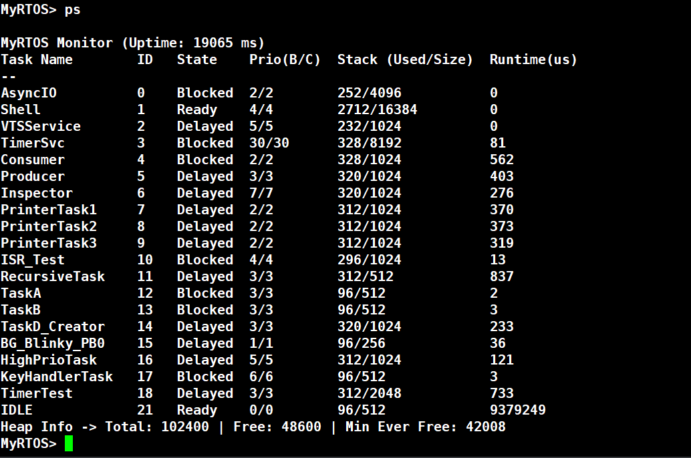

MyRTOS
======

一个基于 Cortex-M4 的多任务调度系统。经过全新架构重构，实现了内核、服务与平台驱动的深度解耦。其结构清晰、API 统一、可移植性强，并提供了内核扩展钩子，适合作为学习实时操作系统原理、研究可移植系统设计的参考项目。

## 功能特性 (概览)

*  分层架构：
    *  Kernel (内核层)：平台无关的核心调度与IPC机制。
    *  Services (服务层)：基于内核API实现的可选功能模块，如日志、监视器等。
    *  Platform (平台层)：封装所有与硬件相关的代码，实现轻松移植。
*  多任务调度：
    *   基于优先级的抢占式调度。
    *   同优先级时间片轮转调度。
*  IPC机制 (Inter-Process Communication)：
    *  消息队列 (Queue)：线程安全，支持阻塞、非阻塞及超时。
    *  计数信号量 (Semaphore)：用于资源计数与任务同步，支持ISR版本。
    *  互斥锁 (Mutex)：包含优先级继承协议以防止优先级反转。
    *  递归互斥锁 (Recursive Mutex)：允许同一任务嵌套持有。
    *  任务通知 (Task Notification)：轻量级的直接到任务的事件传递机制，支持ISR版本。
*  中断管理：
    *   提供`FromISR`版本的API，用于在中断服务程序中安全操作内核对象。
    *   支持临界区嵌套。
    *   采用延迟调度机制（PendSV），优化中断响应。
*  时间管理：
    *   基于系统Tick的任务延时。
    *   软件定时器服务，支持周期性与一次性定时器。
*  内存管理：
    *   基于静态内存池的动态内存分配 (`MyRTOS_Malloc`/`MyRTOS_Free`)。
    *   线程安全，支持空闲块自动合并以减少碎片。
*  任务管理：
    *   支持任务的动态创建、删除、挂起与恢复。
    *   实现任务ID的回收与复用。
    *   提供API以获取任务状态与优先级。
*  高级应用框架:
    *  统一I/O流 (Stream): 解耦上层应用与底层硬件，支持任务级标准IO重定向和管道(Pipe)。
    *  虚拟终端服务 (VTS): 实现物理终端的IO复用、焦点管理和后台流，支持信号传递(Ctrl+C/Ctrl+Z/Ctrl+B)。
    *  进程管理器 (Process): 提供POSIX风格的进程管理，支持进程生命周期、文件描述符表、信号机制。
    *  交互式Shell: 支持命令历史记录（上下箭头浏览）、进程控制、系统监控工具（top/cat）。
*  系统监控与调试：
    *  实时性能监视器 (Monitor)：显示任务状态、优先级、栈使用高水位线、CPU占用率等。
    *  堆内存监控：显示总大小、当前剩余及历史最小剩余。
    *  可配置日志框架：支持异步输出、多路监听和分级过滤。
    *  内核扩展机制 (Hooks)：通过`MyRTOS_RegisterExtension`注册回调，可监听内核关键事件。

## 抽象架构

## 调度机制

## 效果示例

系统监视器 (通过Shell的`ps`命令) 的输出:

调度流程

 

程序管理

 

VTS&日志

## 功能详解

### 分层架构

**设计思路：**
MyRTOS 采用清晰的分层架构，旨在实现内核的高度可移植性与功能的模块化扩展。其核心思想是将操作系统划分为相互独立但接口明确的层次，从而实现“关注点分离”。

*   **内核层 (Kernel):** 这是系统的核心，包含了与具体硬件平台无关的全部调度逻辑、IPC机制、时间管理和内存管理算法。该层的代码（如 `MyRTOS.c`）可以不加修改地运行在任何支持C语言的处理器上。
*   **移植层 (Port/Platform):** 这一层是内核与具体硬件之间的桥梁。它封装了所有与处理器架构和开发板相关的代码，例如：启动调度器 (`MyRTOS_Port_StartScheduler`)、初始化任务堆栈 (`MyRTOS_Port_InitialiseStack`)、实现临界区保护 (`MyRTOS_Port_Enter/ExitCritical`) 以及具体的异常处理函数 (`PendSV_Handler`, `SVC_Handler`)。更换目标硬件时，只需重新实现这一层即可。
*   **服务层 (Services) & 应用框架:** 建立在内核API之上，提供更高级的功能模块，如日志系统、性能监视器、统一I/O流、虚拟终端服务(VTS)和程序管理器。这些服务是可选的，应用程序可以根据需要进行裁剪，它们通过内核扩展机制与内核松耦合地交互。

### 多任务调度

**设计思路：**
MyRTOS 的调度器采用业界主流的 **基于优先级的抢占式调度** 策略，并辅以 **同优先级时间片轮转** 机制。核心设计目标是保证高优先级任务的实时性，同时确保同级任务能够公平地共享CPU资源。

*   **抢占式调度 (Preemptive Scheduling):** 系统总是确保当前正在运行的是处于就绪状态的、优先级最高的任务。当一个更高优先级的任务变为就绪状态（例如，从延时中唤醒或被事件解锁），调度器会立即中断当前任务，并切换到该高优先级任务执行。
*   **时间片轮转 (Round-Robin):** 对于多个具有相同优先级的任务，当一个任务在系统Tick中断触发调度时，调度器会将其移动到该优先级就绪队列的末尾，并选择队列头部的下一个任务来运行，从而实现公平调度。

**核心实现逻辑：**
调度器的实现围绕几个关键的数据结构和函数：

1.  **就绪任务列表 (`readyTaskLists`):** 这是一个数组，数组的每个元素都是一个双向链表的头指针，分别对应一个优先级。例如，`readyTaskLists[5]` 指向所有优先级为5的就绪任务组成的链表。这种结构使得按优先级查找任务的效率非常高。
2.  **优先级位图 (`topReadyPriority`):** 这是一个32位的位图变量。如果优先级 `P` 的就绪链表不为空，那么该变量的第 `P` 位就会被置1。这使得调度器可以极快地找到当前存在的最高优先级。在 `schedule_next_task` 函数中，通过 `31 - __builtin_clz(topReadyPriority)` 这样一条高效的指令（计算前导零个数），就能瞬间定位到最高的就绪优先级，避免了遍历整个 `readyTaskLists` 数组。
3.  **调度函数 (`schedule_next_task`):** 这是调度的核心决策中心。它首先使用优先级位图找到最高的就绪优先级，然后从对应优先级的就绪链表中取出第一个任务。为了实现时间片轮转，如果该链表中还有其他任务，它会将刚刚取出的任务移动到链表的末尾。最后，它更新全局的 `currentTask` 指针，并将新任务的堆栈指针返回给底层的上下文切换代码。
4.  **延迟调度 (Deferred Scheduling):** 为了最大程度地缩短中断关闭时间和中断响应延迟，MyRTOS采用了延迟调度机制。在中断服务程序或临界区代码中，当一个任务状态改变需要进行调度时，系统并不会立即执行上下文切换，而是通过 `MyRTOS_Port_Yield()` 触发一个低优先级的 `PendSV` 异常。`PendSV` 异常会在所有其他中断处理完毕后才执行，真正的上下文切换逻辑位于 `PendSV_Handler` 中。这确保了中断处理的快速返回，提高了系统的实时性。

### IPC机制 (Inter-Process Communication)

**设计思路：**
MyRTOS 提供了一套丰富、健壮且线程安全的IPC机制，用于任务间的同步、通信和资源共享。其设计哲学是提供标准化的接口，支持阻塞、非阻塞和带超时的操作模式。所有IPC对象的操作都通过进入和退出临界区来保证原子性。

**核心实现逻辑：**
IPC机制的核心是一个通用的 **事件列表 (`EventList_t`)** 模型。每个可能导致任务阻塞的IPC对象（如队列、信号量）内部都包含一个或多个事件列表。当一个任务因等待某个事件而需要阻塞时，它会被从全局的就绪列表中移除，然后根据其 **优先级** 插入到该IPC对象的事件列表中 (`eventListInsert`)。当事件发生时，IPC代码会从事件列表中取出 **优先级最高** 的任务（即链表头部的任务），将其移回到就绪列表。

*   **消息队列 (`Queue_t`):** 内部包含一个环形缓冲区、一个等待发送的事件列表 (`sendEventList`) 和一个等待接收的事件列表 (`receiveEventList`)。它实现了一种高效的“直接交接”优化：如果一个任务发送数据时，有另一个任务正在等待接收，数据将直接从发送者拷贝给接收者，而无需经过环形缓冲区。
*   **互斥锁 (`Mutex_t`):** 用于保护共享资源。其关键特性是实现了 **优先级继承 (Priority Inheritance)** 协议来防止“优先级反转”。当一个高优先级任务 `T_H` 尝试获取一个被低优先级任务 `T_L` 持有的锁时，系统会暂时将 `T_L` 的优先级提升到与 `T_H` 相同。这可以防止中等优先级的任务抢占 `T_L`，从而保证 `T_H` 能尽快获得锁。每个任务的TCB中有一个 `held_mutexes_head` 链表，用于精确管理其持有的锁和动态调整后的优先级。
*   **任务信号 (Task Signals):** 一种极其轻量级的事件通信机制。每个任务TCB内嵌了信号相关的字段（`signals_pending`, `signals_wait_mask`等）和一个专用的事件列表 `signal_event_list`。任务调用 `Task_WaitSignal` 时，如果条件不满足，它会阻塞在自己的事件列表上。`Task_SendSignal` 仅需对目标任务的信号位图执行一次原子“或”操作，然后检查是否需要唤醒，效率极高。

### 中断与时间管理

**设计思路：**
系统的实时性与稳定性在很大程度上取决于其对时间和中断的精确管理。MyRTOS的设计目标是：提供可靠的基于系统节拍的时间服务，并确保中断处理高效、安全，将对内核调度器的影响降至最低。

**核心实现逻辑：**

1.  **时间管理:**
    *   **系统节拍 (System Tick):** 整个时间管理系统的基石是一个周期性的硬件定时器中断（`SysTick_Handler`）。
    *   **延迟任务链表 (`delayedTaskListHead`):** 所有延时或超时的任务，都会被插入到这个 **按唤醒时间排序** 的链表中。由于链表是排序的，`MyRTOS_Tick_Handler` 在每个节拍中 **只需检查链表头部** 的任务，看其是否到期需要唤醒。这种设计避免了在每次Tick时遍历所有任务，极大地提高了效率。
2.  **中断管理:**
    *   **临界区保护:** 内核通过关闭和开启全局中断，并使用一个嵌套计数器 `criticalNestingCount`，来保护其关键数据结构在更新过程中不被中断打断。
    *   **`FromISR` API:** 提供了一系列带有 `FromISR` 后缀的专用API（如 `Task_NotifyFromISR`, `Semaphore_GiveFromISR`）。这些API被设计为非阻塞的，并且会通过一个输出参数 `higherPriorityTaskWoken` 告知调用者，它们的操作是否唤醒了一个更高优先级的任务。
    *   **延迟调度 (`PendSV`):** 这是MyRTOS中断管理的核心。当 `FromISR` API或 `MyRTOS_Tick_Handler` 发现有更高优先级的任务被唤醒时，它们并不会立即执行上下文切换，而是仅仅 **触发（置位）一个 `PendSV` 异常**。`PendSV` 被设置为系统中的最低优先级异常，只有在所有其他硬件中断都处理完毕后，`PendSV_Handler` 才会执行真正的上下文切换操作。这种将调度与中断处理分离的策略，确保了系统对外部中断的快速响应。

### 内存管理

**设计思路：**
MyRTOS 实现了一个线程安全的动态内存管理器，它从一个大的、静态分配的内存池 (`rtos_memory_pool`) 中分配内存。该设计旨在为资源受限的嵌入式系统提供可靠的内存分配，同时通过自动合并空闲块来对抗内存碎片化。

**核心实现逻辑：**

*   **内存块结构 (`BlockLink_t`):** 每个内存块（无论空闲或已分配）头部都有一个管理结构，记录了块的大小。空闲块还通过一个指针形成一个单向链表。
*   **空闲链表:** 所有空闲的内存块被组织成一个 **按内存地址排序** 的链表中。这个有序性是实现高效合并的关键。
*   **分配算法 (`rtos_malloc`):** 采用 **首次适应 (First Fit)** 算法。它会遍历空闲链表，查找第一个足够大的内存块。如果找到的块远大于所需大小，它会被 **分裂 (Splitting)** 成两部分：一部分返回给用户，另一部分作为新的、更小的空闲块重新插入空闲链表。分配出去的块会通过在其大小字段的最高位设置一个标志位 (`blockAllocatedBit`) 来标记为“已使用”。
*   **释放与合并 (`rtos_free` & `insertBlockIntoFreeList`):** 当内存被释放时，其“已使用”标志被清除。然后，`insertBlockIntoFreeList` 函数会将其插入到空闲链表的正确位置。在插入过程中，它会检查该块是否与前一个或后一个空闲块在物理上相邻。如果是，它们会被 **合并 (Coalescing)** 成一个更大的空闲块，从而有效地减少内存碎片。

### 高级应用框架

**设计思路：**
高级应用框架（如VTS和程序管理器）的设计目标是在MyRTOS内核提供的多任务和IPC原语之上，构建一个更加抽象、易于使用的应用层。其核心是解耦上层应用与底层硬件，提供类似桌面操作系统的编程模型。

**核心实现逻辑 (构建于内核之上)：**

*   **统一I/O流 (Stream):** 这是框架的基石。它定义了一个抽象的I/O接口（如 `read`, `write`）。具体的“流”可以是包装了UART驱动的物理终端流，也可以是包装了消息队列的“管道(Pipe)”流，用于在程序之间传递数据。`MyRTOS_printf`/`getchar` 等函数会操作当前任务的“标准输入/输出流”。
*   **虚拟终端服务 (VTS):** 这是一个独立的系统服务任务。它管理着物理终端（如UART），并维护着“焦点”的概念。用户的输入会被路由到当前拥有焦点的“前台”程序任务的标准输入流。后台程序的标准输出可以被重定向或丢弃，而其日志输出（通过LOG框架）则可以被VTS捕获并统一显示，从而实现前后台I/O的分离。
*   **程序管理器与Shell:** Shell本身是一个任务，它接收用户命令。当用户执行 `run my_app` 时，Shell会创建一个新的任务来执行 `my_app` 的主函数，并通过VTS将I/O焦点切换到这个新任务。执行 `run my_app &` 则表示创建任务后不切换焦点，使其在后台运行。`jobs`、`kill` 等命令通过遍历内核的任务列表 (`allTaskListHead`) 并调用 `Task_GetState`、`Task_Delete` 等内核API来实现作业控制。

### 系统监控与调试

**设计思路：**
MyRTOS 内置了一个强大的内核扩展机制，这是实现高级调试和监控功能的基础。该机制采用了 **观察者（Observer）或发布-订阅（Publish-Subscribe）设计模式**。内核在执行关键操作时会“发布”一个事件，而外部模块可以作为“订阅者”注册回调函数来接收通知。这种设计实现了监控工具与内核的 **完全解耦**，用户可以在不修改任何内核代码的情况下，深入洞察系统的内部运行状态。

**核心实现逻辑：**

1.  **注册与广播:** 用户通过 `MyRTOS_RegisterExtension` 注册一个回调函数。内核在关键路径点（如任务切换、内存分配、系统Tick）会调用内部的 `broadcast_event` 函数。
2.  **事件驱动:** `broadcast_event` 会填充一个包含事件类型和相关数据的 `KernelEventData_t` 结构体，然后遍历并调用所有已注册的回调函数。
3.  **应用示例:**
    *   **性能监视器 (ps):** 订阅 `KERNEL_EVENT_TICK` 和 `KERNEL_EVENT_TASK_SWITCH_IN/OUT` 事件。通过在每个Tick中累加当前运行任务的时间，并与总时间对比，即可计算出每个任务的CPU占用率。
    *   **堆栈溢出检测:** 在创建任务时，堆栈被填充为魔法数字 (`0xA5A5A5A5`)。性能监视器可以定期或在任务切换时检查从栈底开始的魔法数字是否被意外覆写，从而计算出栈使用高水位线，并及时发现溢出风险。
    *   **内存泄漏分析:** 订阅 `KERNEL_EVENT_MALLOC` 和 `KERNEL_EVENT_FREE` 事件，可以记录每次内存操作的细节（调用者、大小、地址），用于离线分析是否存在内存泄漏。

## 快速开始 & 示例解析

具体的代码示例，演示 MyRTOS 的核心功能。所有示例均源自系统内置的测试用例。

#### 1\. 任务生命周期与调度

##### 动态创建、删除与重建

MyRTOS支持在运行时动态管理任务。`c_task`在完成5次循环后会调用`Task_Delete(NULL)`自行删除。而`d_task`则持续监控`c_task`的存在，一旦发现其被删除，就会重新创建它，展示了任务的完整生命周期管理能力。

    // 任务 C: 运行固定次数后自行删除.
    static void c_task(void *param) {
        for (int i = 1; i <= 5; ++i) {
            LOG_D("Task C", "正在运行, 第 %d 次", i);
            Task_Delay(MS_TO_TICKS(1000));
        }
        LOG_D("Task C", "运行5次后删除自己.");
        g_c_task_h = NULL; // 清理全局句柄
        Task_Delete(NULL); // 删除当前任务
    }

    // 任务 D: 监控并按需重新创建任务 C.
    static void d_task(void *param) {
        while (1) {
            if (g_c_task_h == NULL) {
                LOG_D("Task D", "检测到Task C不存在, 准备重新创建...");
                Task_Delay(MS_TO_TICKS(3000));
                g_c_task_h = Task_Create(c_task, "TaskC_dynamic", 1024, NULL, COLLABORATION_TASKS_PRIO);
            }
            Task_Delay(MS_TO_TICKS(1000));
        }
    }

##### 任务挂起与恢复

`Task_Suspend`和`Task_Resume`允许临时暂停和继续一个任务的执行。在示例中，`suspend_resume_test_task`首先让`target_task`运行5秒，然后将其挂起5秒（此时`target_task`将停止打印日志），最后再恢复它，展示了对任务执行流的精确控制。

    // 目标任务
    static void target_task(void *param) {
        int counter = 0;
        for (;;) {
            LOG_D("TargetTask", "I'm alive! Count = %d", counter++);
            Task_Delay(MS_TO_TICKS(1000));
        }
    }

    // 控制任务
    static void suspend_resume_test_task(void *param) {
        LOG_I("SuspendTest", "Test started. Target task should be running now.");
        Task_Delay(MS_TO_TICKS(5000));

        LOG_I("SuspendTest", "Suspending TargetTask...");
        Task_Suspend(g_target_task_h); // 挂起目标任务
        LOG_I("SuspendTest", "TargetTask has been suspended...");
        Task_Delay(MS_TO_TICKS(5000));

        LOG_I("SuspendTest", "Resuming TargetTask...");
        Task_Resume(g_target_task_h); // 恢复目标任务
        LOG_I("SuspendTest", "TargetTask has been resumed.");

        // ... 测试完成后清理并删除任务 ...
        Task_Delete(NULL);
    }

##### 优先级抢占

`high_prio_task`被赋予了较高的优先级（5）。它每隔5秒打印一条日志。当它从延时中唤醒时，如果当前有任何优先级低于5的任务正在运行，它将立即抢占CPU执行，从而验证了系统的抢占式调度机制。

    // 高优先级任务: 演示抢占.
    static void high_prio_task(void *param) {
        while (1) {
            Task_Delay(MS_TO_TICKS(5000));
            LOG_D("高优先级任务", "<<<<<<<<<< [抢占演示] >>>>>>>>>>");
        }
    }

#### 2\. 任务同步与通信 (IPC)

##### 任务通知 (Task Notification)

`a_task`和`b_task`构成一个协作模型。它们都使用`Task_Wait()`进入阻塞状态，等待通知。`interrupt_handler_task`在被中断唤醒后，会通过`Task_Notify(g_a_task_h)`唤醒`a_task`。`a_task`完成工作后，再唤醒`b_task`，如此交替执行，展示了任务通知作为轻量级同步工具的用法。

    // 任务 A: 等待通知后工作，然后通知任务 B
    static void a_task(void *param) {
        while (1) {
            Task_Wait(); // 等待通知
            LOG_D("Task A", "被唤醒, 开始工作...");
            Task_Delay(MS_TO_TICKS(5000));
            LOG_D("Task A", "工作完成, 唤醒 Task B");
            Task_Notify(g_b_task_h);
        }
    }

    // 任务 B: 等待通知后工作，然后通知任务 A
    static void b_task(void *param) {
        while (1) {
            Task_Wait(); // 等待通知
            LOG_D("Task B", "被唤醒, 开始工作...");
            Task_Delay(MS_TO_TICKS(3000));
            LOG_D("Task B", "工作完成, 唤醒 Task A");
            Task_Notify(g_a_task_h);
        }
    }

##### 消息队列 (Message Queue)

这是一个经典的生产者-消费者模型。`producer_task`（优先级3）不断生产产品并发送到队列。`consumer_task`（优先级2）和`inspector_task`（优先级7）都从该队列接收。由于`inspector_task`优先级最高，它会优先获得CPU并从队列中“拦截”产品，展示了队列作为数据缓冲以及高优先级任务如何优先处理数据的场景。

    // 生产者任务: 向队列发送产品.
    static void producer_task(void *param) {
        Product_t product = {0, 100};
        while (1) {
            product.id++;
            LOG_D("生产者", "生产产品 ID %lu", product.id);
            Queue_Send(g_product_queue, &product, MS_TO_TICKS(100));
            Task_Delay(MS_TO_TICKS(2000));
        }
    }

    // 消费者任务: 从队列接收产品.
    static void consumer_task(void *param) {
        Product_t received_product;
        while (1) {
            LOG_D("消费者", "等待产品...");
            if (Queue_Receive(g_product_queue, &received_product, MYRTOS_MAX_DELAY) == 1) {
                LOG_D("消费者", "接收到产品 ID %lu", received_product.id);
            }
        }
    }

##### 计数信号量 (Counting Semaphore)

此示例模拟了3个任务（`PrinterTask1`, `2`, `3`）竞争2台共享打印机的场景。信号量被创建为`Semaphore_Create(2, 2)`，表示有2个可用资源。任何时候最多只有两个任务能成功获取信号量（`Semaphore_Take`）并“打印”，第三个任务则必须阻塞等待，直到有任务释放信号量（`Semaphore_Give`）。

    // 打印机任务: 演示使用信号量作为资源锁.
    static void printer_task(void *param) {
        const char *taskName = (const char *) param;
        while (1) {
            LOG_D(taskName, "正在等待打印机...");
            if (Semaphore_Take(g_printer_semaphore, MYRTOS_MAX_DELAY) == 1) {
                LOG_D(taskName, "获取到打印机, 开始打印 (耗时3秒)...");
                Task_Delay(MS_TO_TICKS(3000));
                LOG_D(taskName, "打印完成, 释放打印机.");
                Semaphore_Give(g_printer_semaphore);
            }
            Task_Delay(MS_TO_TICKS(500));
        }
    }

##### 递归互斥锁 (Recursive Mutex)

`recursive_test_task`演示了递归锁的特性。任务首先获取一次锁，然后在其持有期间再次获取同一个锁。使用标准互斥锁会导致死锁，但`Mutex_Lock_Recursive`允许多次上锁，只要解锁次数与之对应即可。这对于需要递归调用且全程需要保护共享资源的函数非常有用。

    static void recursive_test_task(void *param) {
        while (1) {
            Mutex_Lock_Recursive(g_recursive_lock);
            LOG_D("递归锁", "主循环加锁 (第1层)");
            Task_Delay(MS_TO_TICKS(500));

            Mutex_Lock_Recursive(g_recursive_lock);
            LOG_D("递归锁", "嵌套加锁 (第2层)");
            Task_Delay(MS_TO_TICKS(500));

            Mutex_Unlock_Recursive(g_recursive_lock);
            LOG_D("递归锁", "嵌套解锁 (第2层)");

            Mutex_Unlock_Recursive(g_recursive_lock);
            LOG_D("递归锁", "主循环解锁 (第1层)");

            Task_Delay(MS_TO_TICKS(3000));
        }
    }

#### 3\. 中断与内核交互

按下用户按键会触发`EXTI0_IRQHandler`中断。在此中断服务程序（ISR）中，调用了两个`FromISR`版本的API：`Task_NotifyFromISR`用于唤醒`interrupt_handler_task`，`Semaphore_GiveFromISR`用于释放信号量以唤醒`isr_test_task`。最后，`MyRTOS_Port_YieldFromISR`会检查是否有更高优先级的任务被唤醒，并在必要时请求进行一次上下文切换，确保了系统的实时响应性。

    // EXTI0 中断服务程序.
    void EXTI0_IRQHandler(void) {
        if (exti_interrupt_flag_get(EXTI_0) != RESET) {
            exti_interrupt_flag_clear(EXTI_0);
            int higherPriorityTaskWoken = 0;

            // 使用任务通知唤醒一个任务
            Task_NotifyFromISR(g_interrupt_task_h, &higherPriorityTaskWoken);

            // 使用信号量唤醒另一个任务
            Semaphore_GiveFromISR(g_isr_semaphore, &higherPriorityTaskWoken);

            // 如果有更高优先级的任务被唤醒，则在中断退出后立即调度
            MyRTOS_Port_YieldFromISR(higherPriorityTaskWoken);
        }
    }

    // 等待中断信号量的任务
    static void isr_test_task(void *param) {
        while (1) {
            if (Semaphore_Take(g_isr_semaphore, MYRTOS_MAX_DELAY) == 1) {
                LOG_D("ISR测试", "成功从按键中断获取信号量!");
            }
        }
    }

#### 4\. 软件定时器

系统创建了两个软件定时器：一个5秒后触发一次的单次定时器，和一个每10秒触发一次的周期性定时器。当定时器到期时，RTOS的定时器服务任务会调用相应的回调函数（`single_timer_cb`, `perio_timer_cb`）来执行预定操作，而不会阻塞任何其他任务。

    // 创建定时器
    g_single_timer_h = Timer_Create("单次定时器", MS_TO_TICKS(5000), 0, single_timer_cb, NULL);
    g_perio_timer_h = Timer_Create("周期定时器", MS_TO_TICKS(10000), 1, perio_timer_cb, NULL);
    Timer_Start(g_single_timer_h, 0);
    Timer_Start(g_perio_timer_h, 0);

    // 周期性定时器回调.
    static void perio_timer_cb(TimerHandle_t timer) {
        LOG_D("定时器回调", "周期性定时器(10秒)触发!");
    }

    // 一次性定时器回调.
    static void single_timer_cb(TimerHandle_t timer) {
        LOG_D("定时器回调", "一次性定时器(5秒)触发!");
    }

#### 5\. 应用框架：VTS 与程序管理器

通过Shell，用户可以与系统进行交互，运行已注册的程序。这些程序利用了VTS提供的标准I/O功能。

##### 交互式前台程序

`echo`程序在前台运行，它使用`MyRTOS_getchar()`接收来自物理终端的字符，并用`MyRTOS_putchar()`回显，实现了与用户的直接交互。

    // "echo" 程序: 回显用户输入
    static void echo_main(int argc, char *argv[]) {
        char ch;
        MyRTOS_printf("Echo program started. Press 'q' to quit.\n");
        for (;;) {
            ch = MyRTOS_getchar(); // 从标准输入读取
            if (ch == 'q') {
                break;
            }
            MyRTOS_putchar(ch); // 写入标准输出
        }
    }

##### 后台守护程序

`looper`程序通常在后台运行（通过 `run looper &` 命令）。它演示了VTS的I/O分流：使用`MyRTOS_printf`的输出会被丢弃，因为它没有焦点终端；而使用`LOG_I`的输出则会被重定向到VTS的后台流，最终显示在屏幕上，不会干扰前台操作。

    // "looper" 程序: 在后台周期性打印消息.
    static void looper_main(int argc, char *argv[]) {
        int count = 0;
        for (;;) {
            // 该输出在后台模式下被VTS丢弃
            MyRTOS_printf("[looper BG via printf] This is silent. Count: %d\n", count);
            // 该输出通过VTS后台流，总是可见
            LOG_I("looper", "Hello from background via LOG! Count: %d", ++count);
            Task_Delay(MS_TO_TICKS(2000));
        }
    }

##### Shell交互示例

    MyRTOS> ls                # 列出所有可执行程序
    Available programs:
      looper          - 一个简单的后台循环程序.
      echo            - 回显用户输入, 直到按下 'q'.
      hello           - 打印 Hello World.

    MyRTOS> run echo          # 运行前台程序，VTS焦点切换
    Echo program started. Type characters to echo.
    Press 'q' to quit.
    test
    test
    q

    MyRTOS> run looper &      # 在后台运行程序
    [2] looper

    MyRTOS> jobs              # 查看当前作业
    PID  | STATUS       | NAME
    -----|--------------|----------------
    2    | Running      | looper

    MyRTOS> kill 2            # 终止后台作业
    Process 2 terminated.

    MyRTOS> kill -STOP 3      # 挂起进程
    Process 3 suspended.

    MyRTOS> kill -CONT 3      # 恢复进程
    Process 3 resumed.

    MyRTOS> top               # 实时系统监控
    MyRTOS System Monitor - Press Ctrl+C to exit

    ========================================
    Heap: Total=65536, Free=45120, MinFree=42048
    ----------------------------------------
    NAME         STATE    PRIO  STACK     CPU%
    ----------------------------------------
    IDLE         Running  0      120/256    85%
    Shell        Ready    2     1024/4096   10%
    VTS          Blocked  5      128/256     2%
    ========================================

    MyRTOS> cat heap          # 查看堆内存统计
    堆内存统计:
      总大小:     65536 字节
      剩余:       45120 字节
      历史最小:   42048 字节
      使用率:     31%

    MyRTOS> cat tasks         # 查看任务列表
    任务列表:
    NAME             STATE      PRIO
    ------------------------------------------
    IDLE             Running    0
    Shell            Ready      2
    VTS              Blocked    5

## 未来扩展

*   实现一个简单的文件系统服务。
*   集成轻量级网络协议栈
*   完善电源管理功能。

## 作者

XiaoXiu
